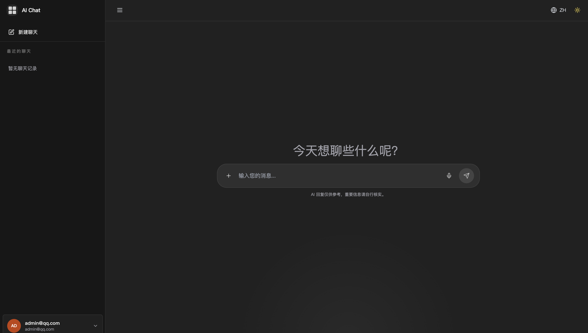
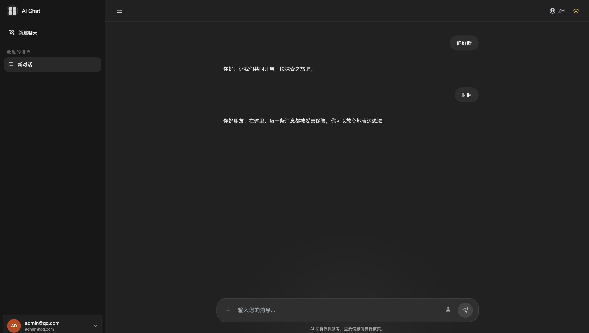
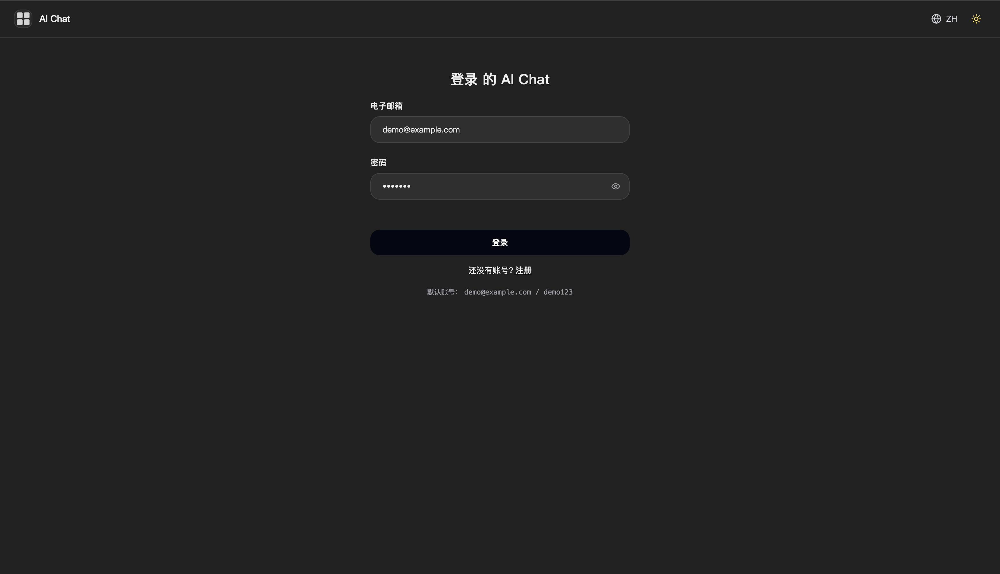
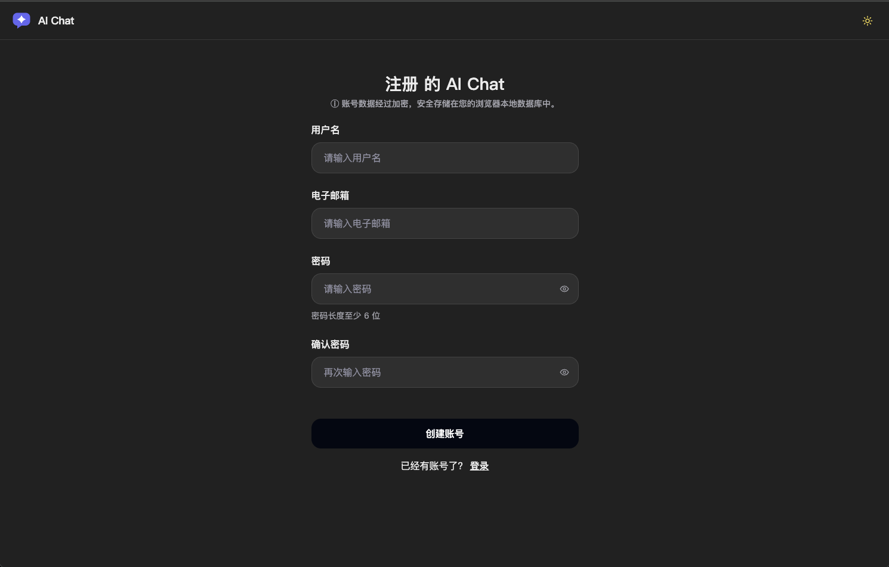

# React Chat GPT

一个以 `ChatGPT Web` 为视觉参考实现的聊天项目，支持两种运行形态：

- 纯前端演示模式：登录、会话、模型配置都保存在浏览器本地，适合作品演示和前端联调
- 前后端一体模式：带真实登录态、服务端代理模型请求、服务端加密存储 API Key，适合继续往可部署产品演进

项目基于 `React + Vite + Tailwind CSS` 构建，包含登录页、聊天页、深浅主题切换、本地会话持久化、演示模式聊天，以及接入真实模型服务的完整扩展路径。

## 项目预览









## 项目简介

这个项目的目标不是简单复刻一个聊天框，而是完成一套可以实际演示的 AI 聊天前端体验：

- 具有接近 ChatGPT 的布局结构与交互风格
- 支持新建会话、历史记录切换、删除会话
- 支持空状态居中输入框与对话状态底部输入框切换
- 支持深色 / 浅色主题切换
- 支持中英文切换
- 支持无后端环境下的本地 Demo 演示
- 支持后续接入 Open WebUI / Ollama 风格接口

## 项目亮点

### 1. 聊天体验完整

- 新建对话时，输入框居中展示，更接近真实产品体验
- 开始聊天后，输入框自动切换到底部悬浮布局
- 支持流式消息展示
- 支持首轮对话自动生成标题

### 2. 视觉细节统一

- 参考 ChatGPT 的左侧导航 + 主内容区布局
- 深浅主题切换时统一了背景、边框、文字、按钮、图标的过渡节奏
- 侧边栏底部用户区支持点击弹出上方退出菜单

### 3. 模型接入路径清晰

- 设置弹窗内置 `演示模式`、`自定义 OpenAI 接口`、`服务器托管` 三种配置路径
- 支持通过 `/models` 自动拉取模型列表，也支持手动维护模型名
- 支持用环境变量预置默认 provider / model，用户在设置弹窗里的显式选择优先级更高

### 4. 演示模式友好

- 无需后端即可直接体验完整聊天流程
- 支持“演示登录”
- 自动返回本地模拟 AI 回复
- 会话记录保存在浏览器 `IndexedDB`

### 5. 具备扩展性

- 已拆分基础 API 层、Hook、组件层和本地存储层
- 可平滑切换到真实模型服务
- 适合作为 AI Web 产品前端模板继续开发

## 技术栈

- `React 18`
- `Vite 5`
- `Tailwind CSS`
- `React Router`
- `MobX`
- `IndexedDB(idb)`
- `Axios`
- `i18next`
- `Lucide React`
- `ESLint 9`

## 页面与功能

### 登录页

- 登录 / 注册切换
- 浅色 / 深色主题适配
- 中英文切换
- 演示登录入口

### 聊天页

- 左侧会话栏
- 新建聊天
- 历史会话切换
- 删除会话
- 用户信息区下拉退出菜单
- 模型切换入口
- 空状态欢迎区
- 底部悬浮输入框

## 运行方式

### 纯前端演示（无需后端）

```bash
npm install
npm run dev
```

如果需要显式声明演示模式，先复制环境变量样例：

```bash
cp .env.example .env.local
npm run dev
```

默认本地地址：

```bash
http://localhost:5173
```

### 前后端一体（服务器托管模式）

```bash
# 首次：安装两端依赖并准备环境变量
npm install
npm install --prefix server
cp .env.example .env.local
cp server/.env.example server/.env

# 一条命令同时起前端(5173)与后端(3000)
npm run dev:all
```

其中至少需要修改：

- 前端 `.env.local` 中的 `VITE_USE_LOCAL_DATA=false`
- 前端 `.env.local` 中的 `VITE_WEBUI_BASE_URL=http://localhost:3000`
- 后端 `server/.env` 中的 `SESSION_SECRET`
- 后端 `server/.env` 中的 `ENCRYPTION_KEY`，可用 `openssl rand -hex 32` 生成

默认开发地址：

- 前端：http://localhost:5173
- 后端：http://localhost:3000

## 模型与 API 配置

设置弹窗“模型与 API 配置”目前支持三种模式：

### 1. 演示模式（demo）

- 不依赖后端
- AI 回复来自本地 mock 数据
- 会话和配置保存在浏览器 `IndexedDB` / `localStorage`
- 适合演示 UI、交互、主题切换和多会话流程

### 2. 自定义 OpenAI 接口（custom）

- 直接从浏览器请求兼容 OpenAI 的三方模型平台
- 支持填写 `Base URL`、`API Key`、模型列表、默认模型、上下文预算、Think 开关
- 填好地址和密钥后，前端会尝试请求 `{baseUrl}/models` 自动拉取模型列表
- 若平台限制浏览器跨域访问 `/models`，仍可手动填写模型名并直接保存使用
- API Key 仅保存在浏览器本地，做了简单编码，不等同于安全加密

### 3. 服务器托管（backend）

- 仅在 `VITE_USE_LOCAL_DATA=false` 且后端已启动时展示
- 需要先登录，再由服务端代理请求上游模型接口
- 服务端会把 API Key 以 AES-256-GCM 加密后存入数据库，浏览器端不保存明文密钥
- 模型列表由后端请求上游 `/models` 获取，可绕开浏览器 CORS 限制

### 配置优先级

当前生效的模型提供方优先级如下：

1. 用户在设置弹窗里显式保存过的 provider / model
2. 演示模式默认值（本地数据模式下默认为 `demo`）
3. 构建环境变量中的默认值

可用的前端环境变量如下：

| 变量 | 默认值 | 说明 |
| --- | --- | --- |
| `VITE_USE_LOCAL_DATA` | `true` | `true` 时走纯前端演示数据；`false` 时对接真实后端 |
| `VITE_WEBUI_BASE_URL` | 开发环境自动推断为 `http://localhost:3000` | 前端请求后端的基础地址 |
| `VITE_APP_NAME` | `AI Chat` | 页面标题和应用名 |
| `VITE_DEFAULT_LLM_PROVIDER` | `demo` | 默认 provider，仅在用户尚未保存设置时生效 |
| `VITE_DEFAULT_LLM_MODEL` | `gpt-4o-mini` | 默认模型名，仅在用户尚未保存设置时生效 |

后端会额外提供两个接口给前端使用：

- `GET /api/v1/llm/models`：服务器托管模式下获取当前账号可用模型列表
- `POST /api/v1/llm/*`：由服务端代理转发实际的模型请求

## 工程化

| 命令 | 说明 |
| --- | --- |
| `npm run dev:all` | 前端 + 后端一键启动（concurrently） |
| `npm test` | 前端单测（vitest）：SSE 解析故障注入、think 标签分流器 |
| `npm run test:server` | 服务端测试（node 内置 test runner）：加解密、限流、登录链路与代理的集成测试 |
| `npm run test:all` | 两端测试全跑 |
| `npm run lint` | ESLint（前后端同一套 flat config） |

- 服务端集成测试使用 `PORT=0` 随机端口 + `DB_PATH` 临时数据库，不污染开发数据
- CI（GitHub Actions）：push / PR 自动跑 lint + 两端测试 + 构建，见 `.github/workflows/ci.yml`
- 环境变量样例：前端 `.env.example`、后端 `server/.env.example`（均不含真实密钥）

## 演示方式

如果你只是想展示这个作品，不需要准备后端服务：

1. 启动项目
2. 进入登录页
3. 点击 `演示登录（无需后端）`
4. 直接开始聊天

演示模式下支持：

- 本地登录
- 模型选项展示
- 本地模拟回复
- 本地历史会话存储

## 🔌 大模型公共接口与驱动重构 (LLM Provider & Adapters)

为了提升项目的**开源级别**并方便开发者自由扩展大模型，我们对大模型请求层进行了**策略模式与服务注册**的架构重构。现在所有的请求驱动都统一继承自 `BaseProvider`。

### 1. 架构设计 (Architecture)

- **`BaseProvider`** (`src/apis/providers/base.js`): 核心抽象基类，提供了强健的流式 Server-Sent Events (SSE) 协议解析器，能有效合并由于网络分片/粘包引起的残缺 JSON 分包。
- **`DemoProvider`** (`src/apis/providers/demo.js`): 本地 Mock 离线演示驱动，负责高逼真度地模拟流式字词打印。
- **`OpenAIProvider`** (`src/apis/providers/openai.js`): 通用 OpenAI 兼容驱动（支持任意兼容 OpenAI API 协议的三方平台如 DeepSeek, 智谱, Moonshot, 通义千问等）。
- **`OllamaProvider`** (`src/apis/providers/ollama.js`): 本地 Ollama 私有化部署驱动，处理 NDJSON (Newline Delimited JSON) 解析。
- **`ProviderRegistry`** (`src/apis/providers/index.js`): 驱动注册中心，根据用户配置动态派发对应的驱动。

---

### 2. 如何接入一个新的自定义大模型 API (How to add a new custom LLM)

只需三个简单步骤即可扩展您专属的大模型：

1. **新建驱动类**：在 `src/apis/providers/` 下新建一个驱动文件（例如 `my-custom.js`），继承自 `BaseProvider` 并实现 `complete` 方法：
   ```javascript
   import { BaseProvider } from './base';

   export class MyCustomProvider extends BaseProvider {
     async complete(params, callback, signal) {
       const { messages, model } = params;
       
       // 发起您的自定义请求
       const response = await fetch('https://api.my-llm.com/v1/chat', {
         method: 'POST',
         body: JSON.stringify({ messages, model, stream: true }),
         signal
       });

       // 使用基类提供的通用流式解析器 (或自定义解析逻辑)
       await this.parseStream(
         response.body, 
         callback, 
         signal, 
         (parsedJson) => parsedJson.choices?.[0]?.delta?.content
       );
     }
   }
   ```

2. **注册驱动**：在 `src/apis/providers/index.js` 中引入并注册您的新驱动：
   ```javascript
   import { MyCustomProvider } from './my-custom';
   // ...
   this.providers = {
     demo: new DemoProvider(),
     custom: new OpenAIProvider(),
     ollama: new OllamaProvider(),
     mycustom: new MyCustomProvider(), // 👈 注册在此处
   };
   ```

3. **配置并使用**：在前端设置或配置 `.env` 环境，即可无缝激活并使用您的新大模型。

---

### 3. Docker 部署支持 (Self-Hosting via Docker)

项目支持一键自托管部署。

```bash
# 1. 复制并根据需要修改环境变量
cp .env.example .env

# 2. 构建并运行 Docker 镜像
docker build -t react-chat-gpt .
docker run -d -p 8080:80 react-chat-gpt
```

---

## 接口扩展

当前项目已经预留了前后端接入结构，默认按 Open WebUI / Ollama 风格组织：

- 鉴权：`/api/v1/auths/*`
- 模型列表：`/api/v1/llm/models`
- 接口注册器：`src/apis/providers/index.js`

如果要继续接真实服务，可以重点查看：

- `src/apis/chat.js`
- `src/apis/auths.js`
- `src/apis/models.js`
- `src/constants/index.js`

## 项目结构

```bash
src/
├── apis/          # 接口封装
├── components/    # 页面组件
├── contexts/      # 主题上下文
├── hooks/         # 业务 Hook
├── locales/       # 国际化文案
├── pages/         # 页面级组件
├── store/         # 本地状态与 IndexedDB
└── style/         # 全局样式

server/
├── src/
│   ├── routes/        # auth / llm 路由
│   ├── middleware/    # 鉴权、限流
│   ├── crypto.js      # API Key 加解密
│   ├── db.js          # SQLite 初始化
│   └── sessionStore.js
└── data/              # 本地 SQLite 数据文件
```

## 我在这个项目中完成的内容

- 补齐演示模式，使项目在无后端时也可以完整展示
- 优化聊天页布局，使其更接近 ChatGPT 风格
- 重构深浅主题视觉效果与切换动画
- 修复新建会话、标题更新、本地持久化等交互细节
- 优化登录页视觉层次
- 增加用户区退出下拉菜单
- 增加设置弹窗中的模型与 API 配置能力，支持演示模式、自定义 OpenAI 接口与服务器托管模式
- 整理工程配置并补齐前后端测试、环境变量与文档说明

## 校验命令

```bash
npm run lint
npm test
npm run test:server
npm run build
```


